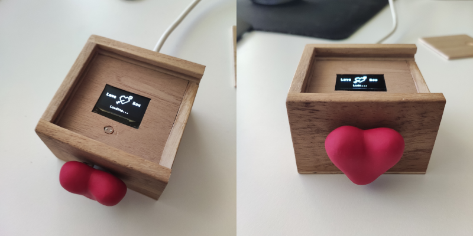
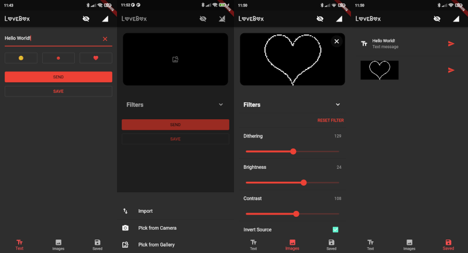
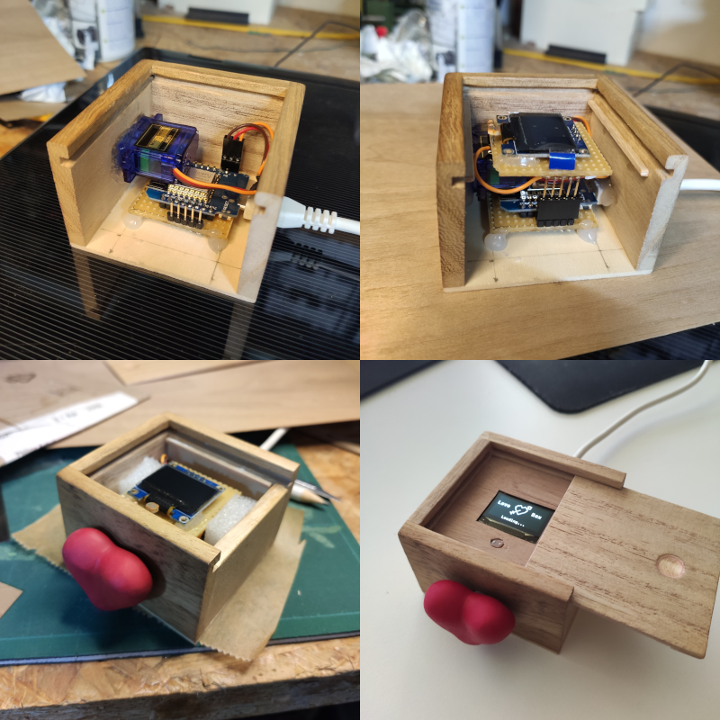

#  LoveBox
My homemade LoveBox inspired by the commercial https://en.lovebox.love/ and the DIY variant from @julisa99 https://github.com/julisa99/Lovebox . Hardware (Wiring / PCB / Components) is very similar to julisa's design.



## Improvements
Since I'm not too familiar with Arduino or hardware in general, most improvements are of software nature.

### Hardware (Mostly differences not improvements)
1. Box is a cut down version of a wooden box from DIY-store
2. The heart is made from [FIMO](https://www.amazon.de/-/en/Steadtler-Hardening-Modelling-Cardboard-assorted/dp/B07N7H98HX/ref=sr_1_5?keywords=Fimo&qid=1663180569&sr=8-5)
3. [Microcontroller esp8266](https://www.amazon.de/-/en/gp/product/B01N9RXGHY/ref=ppx_yo_dt_b_asin_title_o05_s00?ie=UTF8&th=1) 
4. No darkening foil

### Software
1. MQTT instead of polling
2. Simple JSON based protocol
3. Improved bitmap encoding. Each bit represents a pixel (Instead of an ascii character per pixel)
4. Realtime events (Lid open / Ping response)
5. Loading screen animation
6. Display timeout
7. JSON config file

## App
To make it easier and simpler to send messages to the LoveBox, I have developed a Flutter app.



### Features
* Send Text and Images
* Image importing, conversion and filtering (Floyd Steinberg, brightness, contrast, etc.)
* Save messages
* Lid status / connection indicator
* Configurable MQTT broker settings

### Limitations
Only android build was tested. Web will only work with Web Socket MQTT connection. At the moment only direct TCP is implemented. App was developed in a rush and does not follow any proper state management.

## Build your own
If you want to make your own LoveBox, you can follow this short instructions.



### Hardware
1. Use parts and schematics from https://github.com/julisa99/Lovebox
2. Use this or compatible [esp8266](https://www.amazon.de/-/en/gp/product/B01N9RXGHY/ref=ppx_yo_dt_b_asin_title_o05_s00?ie=UTF8&th=1)

### MQTT Broker
You can use any broker or host your MQTT server. Note: [HiveMQ](https://www.hivemq.com/) offers a free restricted version for small IoT projects.

### Arduino
1. Install following libs
    * Adafruit GFX Library
    * Adafruit SSD1306
    * ArduinoJson
    * Base64_Codec
    * PubSubClient
    * ESP8266FS
    * ESP8266LittleFS
2. Modify esp8266_lovebox/data/config.cfg Fill in your WIFI and MQTT authentication data. Do not modify "mqtt_topic", "mqtt_control_in_topic" and "mqtt_control_out_topic".
3. Use ESP8266LittleFS data upload option, to upload config.cfg to arduino.
4. Flash project

### App
You have two options, use the provided apk or build the project yourself. Checkout https://docs.flutter.dev/get-started/install for flutter setup.

## Inspiring links
[https://github.com/julisa99/Lovebox](https://github.com/julisa99/Lovebox)

[https://github.com/JulianBeaulieu/DIY-LoveBox](https://github.com/JulianBeaulieu/DIY-LoveBox)

[https://github.com/claitz/Lovebox-WebSocket](https://github.com/claitz/Lovebox-WebSocket)

[https://github.com/raven-worx/loveboxpi](https://github.com/raven-worx/loveboxpi)

License
-------
```
MIT License

Copyright (c) 2022 Philipp Kutsch
 
Permission is hereby granted, free of charge, to any person obtaining a copy
of this software and associated documentation files (the "Software"), to deal
in the Software without restriction, including without limitation the rights
to use, copy, modify, merge, publish, distribute, sublicense, and/or sell
copies of the Software, and to permit persons to whom the Software is
furnished to do so, subject to the following conditions:

The above copyright notice and this permission notice shall be included in all
copies or substantial portions of the Software.

THE SOFTWARE IS PROVIDED "AS IS", WITHOUT WARRANTY OF ANY KIND, EXPRESS OR
IMPLIED, INCLUDING BUT NOT LIMITED TO THE WARRANTIES OF MERCHANTABILITY,
FITNESS FOR A PARTICULAR PURPOSE AND NONINFRINGEMENT. IN NO EVENT SHALL THE
AUTHORS OR COPYRIGHT HOLDERS BE LIABLE FOR ANY CLAIM, DAMAGES OR OTHER
LIABILITY, WHETHER IN AN ACTION OF CONTRACT, TORT OR OTHERWISE, ARISING FROM,
OUT OF OR IN CONNECTION WITH THE SOFTWARE OR THE USE OR OTHER DEALINGS IN THE
SOFTWARE.
```

###### tags: `LoveBox` `DIY` `Arduino` `Flutter` `App` `MQTT` `Instruction`